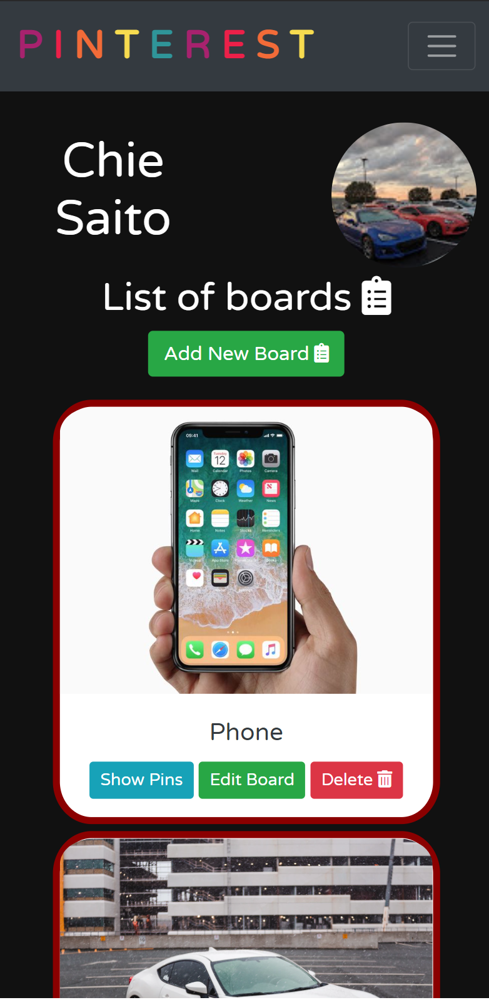

#  Chie's Pinterest

<a href="https://cs-pinterest.netlify.app/" target="_blank">Chie's Pinterest Deployed Site</a>

Chie's Pinterest gives you an unique pinterest-like experience. As an user, you can create boards and collect pins however many you like. You can see all the pins you have as well as public pins. You can click "pin" to any public pins and it will all become yours. Have fun!

## Images of Chie's Pinterest
Dark Move vs Light Mode

  
  

### Mobile screen

  
  

## Technologies
HTML / CSS / JavaScript

## Features
<ul>
  <li>User can create/read/update/delete boards</li>
  <li>User can create/read/update/delete pins</li>
  <li>User can make public pins to own pins</li>
  <li>Dark mode/light mode available</li>
</ul>

## Featured Video

## Project Board
<a href="https://github.com/chiestroud/ASSIGNMENT-Firebase-Pinterest/projects/1" target="_blank">Chie's Pinterest Project Board</a>

## ERD
<a href="https://dbdiagram.io/d/60405bb9fcdcb6230b227f18" target="_blank">ERD Used</a>

## Wireframe
<a href="https://www.figma.com/file/7fWlyA3kfMRzDoZQ0qu1P4/Pinterest?node-id=0%3A1" target="_blank">Chie's Figma</a>
